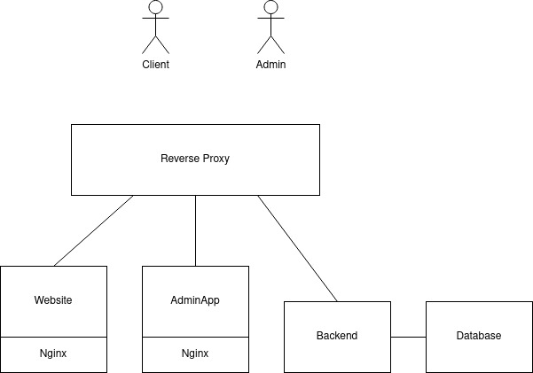

# Site web de l'Hôtel Beausite Adelboden

Ce document décrit la documentation, le développement, la mise en marche de l'application. Cette application est une application MEAN (Mongo Express, Angular, Node)

## Description générale

### Origine du projet

Afin de rendre service à un ami d'enfance, j'ai décidé de lui apprendre à coder une application web de fond en comble. Dans un premier temps, il était convenu que je l'aide à réaliser la tâche. Et progressivement, j'ai complètement pris le relais. Le projet a débuté pendant le premier confinement de la pandémie de COVID-19. Je suis monté à la montagne plusieurs fois où j'ai pu prendre des images avec mon drone, avancer le site, passer du temps avec mon ami et prendre l'air alpin.

### Portée du projet et Hôtel Beausite

L'Hôtel Beausite est un hôtel 4 étoiles situé à Adelboden dans le canton de Berne. Il comporte un fitness, un spa/wellness, un parking, un local de ski, un restaurant et plusieurs chambres. L'ancien site web n'était pas responsive et complètement statique. C'est pourquoi il vise a être remplacé par ce projet. L'idée était d'avoir un site web reprenant les rubriques de l'autre site en ajoutant du contenu dynamique. Les rubriques sont:

-   page accueil: présente l'hôtel et permet de réserver une chambre
-   promotions: présente les différentes offres actuelles
-   restaurant: présente le menu du jour et la carte
-   images: affiche une gallerie photo
-   wellness: présente le spa
-   fitness: présente l'offre du fitness et le matériel
-   reviews: récolte les avis des utilisateurs
-   contact: permet de contacter la réception de l'hôtel

De plus, une interface de gestion de contenu a été pensée afin de gérer tout le contenu dynamique. A noter:

-   promotions: les promotions comportent un titre, un sous-titre, une description, une image et un pdf
-   menu du jour: Le menu du jour est un pdf
-   menu à la carte: le menu à la carte comporte un titre, une image, un prix et une description.
-   reviews: un reviews combine une description, un titre et une note composée de plusieurs critères.

Afin de stocker toutes ces données dynamiques, mongodb une base de donnée nosql a été choisie.

Ensuite afin de traiter toutes ces données, il a fallu créer une API avec nodejs et Express.

### Structure de l'application

L'application comporte 5 composants:

-   bs-Website: le site web décrit ci-dessus (Angular 13)
-   bs-Admin: l'interface de gestion de contenu (Angular 13)
-   bs-API: l'API de traitement des données (Nodejs 16, Express, ...)
-   bs-Database: la base de donnée nosql (mongo)
-   bs-Rproxy: le point d'entrée de l'application (traefik)

### Déploiement de l'application

Cette application sera déployée en utilisant la technologie de containerisation docker. Chaque service sera porté sur un container et le tout sera orchestré à l'aide d'un fichier `docker-compose.yml`. Chaque container sera un service qui se relancera automatiquement à chaque fois qu'ils seront down.

## Configuration des services

### Bs-Database

**Dockerfile**

    FROM mongo:latest
    WORKDIR .
    COPY . .
    COPY populate.sh /docker-entrypoint-initdb.d/
    COPY \*.json /docker-entrypoint-initdb.d/
    EXPOSE 27017

**Configuration traefik**

Etant donné que la base de donnée doit être uniquement disponible

### Bs-Website

**Dockerfile**

    #### Stage 0, Build website from a node image
    FROM node:lts-alpine as build
    LABEL author="Olivier D'Ancona"
    RUN npm i npm@latest -g
    WORKDIR /app
    COPY package.json package-lock.json* ./
    RUN npm install --no-optional && npm cache clean --force
    COPY . .
    RUN npm run build

    ####Stage 1, Build Nginx backend
    FROM nginx:alpine
    COPY --from=build /app/dist/bs-website /usr/share/nginx/html
    COPY nginx.conf /etc/nginx/conf.d/default.conf
    EXPOSE 80

**Configuration traefik**

    - traefik.enable=true
    - traefik.http.routers.bs-website.rule=Host(`localhost`)
    - traefik.port=80
    - traefik.http.services.bs-website.loadbalancer.sticky=true
    - traefik.http.services.bs-website.loadbalancer.sticky.cookie.name=StickyCookie

### Bs-Admin

**Dockerfile**

    #### Stage 0, Build admin app from a node image
    FROM node:lts-alpine as build
    LABEL author="Olivier D'Ancona"
    RUN npm i npm@latest -g
    WORKDIR /app
    COPY package.json package-lock.json* ./
    RUN npm install --no-optional && npm cache clean --force
    COPY . .
    RUN npm run build

    ####Stage 1, Build Nginx http server
    FROM nginx:alpine
    COPY --from=build /app/dist/bs-admin /usr/share/nginx/html
    COPY nginx.conf /etc/nginx/conf.d/default.conf
    EXPOSE 80

**Configuration traefik**

    - traefik.enable=true
    - traefik.http.routers.bs-admin.rule=Host(`admin.localhost`)
    - traefik.port=80
    - traefik.http.services.bs-admin.loadbalancer.sticky=true
    - traefik.http.services.bs-admin.loadbalancer.sticky.cookie.name=StickyCookie

### Bs-API

**Dockerfile**

    #### Stage 0, Build Beausite API
    FROM node:alpine
    LABEL author="Olivier D'Ancona"
    WORKDIR /app
    COPY package.json ./
    RUN npm install
    COPY . .
    EXPOSE 1470
    CMD ["node","server.js"]

**Configuration traefik**

    - traefik.enable=true
    - traefik.http.routers.bs-api.rule=Host(`localhost`) && PathPrefix(`/api`)
    - traefik.http.middlewares.bs-api-strip.stripprefix.prefixes=/api
    - traefik.http.routers.bs-api.middlewares=bs-api-strip@docker
    - traefik.port=80
    - traefik.http.services.bs-api.loadbalancer.sticky=true
    - traefik.http.services.bs-api.loadbalancer.sticky.cookie.name=StickyCookie

### Bs-Rproxy
